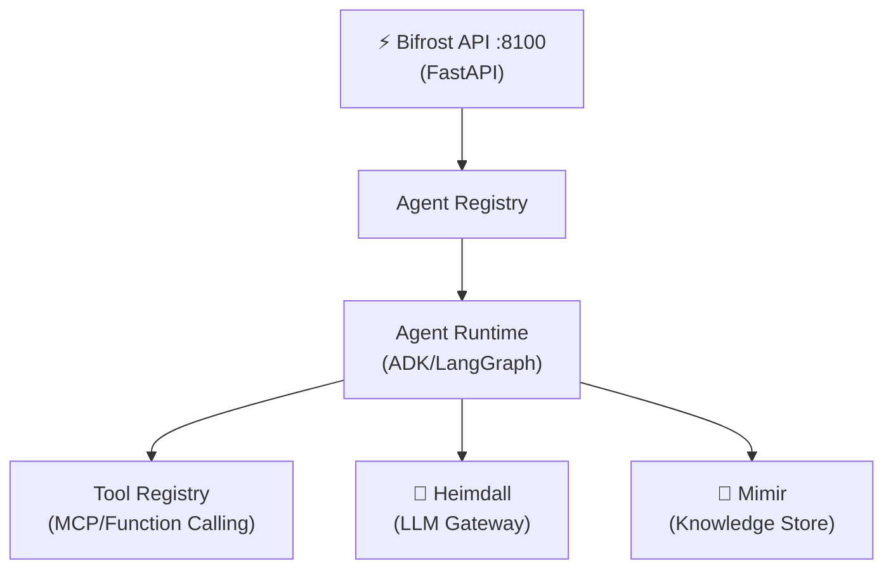

# SI-01: Software Implementation Report — Bifrost

**Product:** ⚡ Bifrost (Agent Runtime Engine)
**Document ID:** SI-RPT-BIFROST-001
**Version:** 0.2.0
**Date:** 2026-03-21
**Standard:** ISO/IEC 29110 — SI Process
**Stack:** 🐍 Python (FastAPI)

---

## 1. Product Overview

| Field | Value |
|:--|:--|
| **Repository** | MegaWiz-Dev-Team/Bifrost |
| **Port** | `:8100` |
| **Container** | `asgard_bifrost` |
| **Dependencies** | Heimdall (LLM), Mimir (Knowledge), Odin (dashboard) |

---

## 2. Architecture

## 3. Functional Requirements

| FR | Description | Status |
|:--|:--|:--|
| FR-B01 | Agent registration & lifecycle | ✅ Done |
| FR-B02 | Tool binding (MCP/function calling) | ✅ Done |
| FR-B03 | LLM routing via Heimdall | ✅ Done |
| FR-B04 | Agent execution with timeout | ✅ Done |
| FR-B05 | Multi-agent orchestration | ✅ Done |
| FR-B06 | AI Guardrails (PII, content filter) | ✅ Done |
| FR-B07 | Security: CORS hardening (CWE-942) | ✅ Done (S32) |
| FR-B08 | Self-aware agent system | 📋 Planned |

## 4. API Endpoints

| Method | Path | Description |
|:--|:--|:--|
| `GET` | `/health` | Health check |
| `POST` | `/api/agents` | Register agent |
| `POST` | `/api/execute` | Execute agent task |
| `GET` | `/api/tools` | List available tools |

## 5. Configuration

| Variable | Default | Description |
|:--|:--|:--|
| `BIFROST_HOST` | `0.0.0.0` | Host |
| `BIFROST_PORT` | `8100` | Port |
| `HEIMDALL_URL` | `http://localhost:8080` | LLM Gateway |
| `MIMIR_URL` | `http://localhost:3000` | Knowledge API |
| `DEFAULT_MODEL` | `qwen3.5` | Default LLM model |
| `MAX_ITERATIONS` | `10` | Agent max iterations |
| `MAX_EXECUTION_TIME` | `120` | Timeout (secs) |
| `CORS_ALLOWED_ORIGIN` | `http://localhost:3000` | CORS allowed origin (S32 security fix) |

## 6. Security Fixes (S32)

| ID | Finding | Severity | Fix | PR | Status |
|:--|:--|:--|:--|:--|:--|
| RA-001 | CORS wildcard `allow_origins=["*"]` (CWE-942) | 🟠 HIGH | Explicit allow-list + `CORS_ALLOWED_ORIGIN` env var | [#10](https://github.com/MegaWiz-Dev-Team/Bifrost/pull/10) | ✅ Fixed |

**Pipeline**: Huginn scan → Muninn analysis → Odin approved → Draft PR → 216 tests pass → Squash merged

---

*บันทึกโดย: AI Assistant (ISO/IEC 29110 SI Process)*
*Created: 2026-03-18 | Updated: 2026-03-21 by Antigravity*
*S32: CORS wildcard fix (CWE-942) via Odin pipeline*
